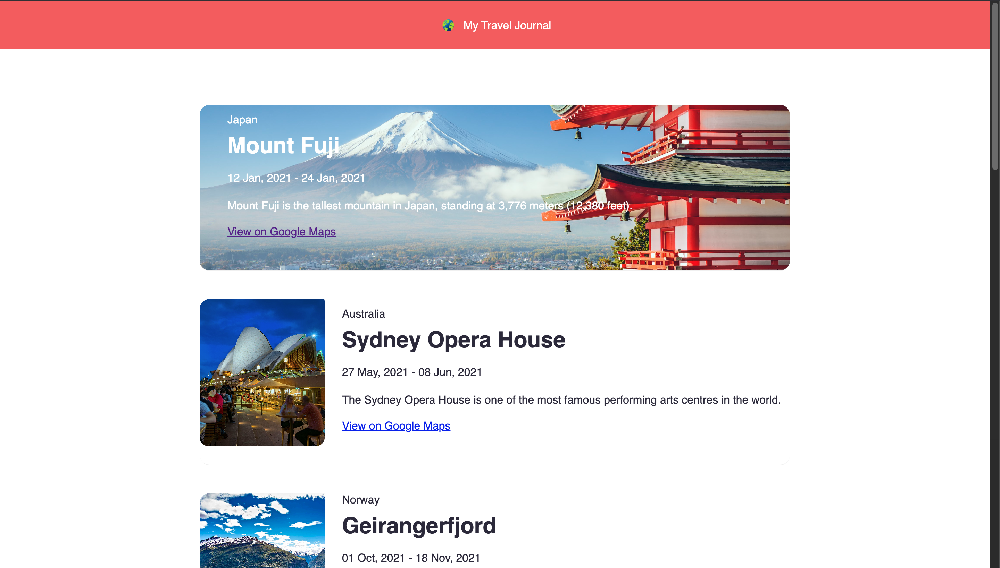

# 🌍 Travel Journal

A modern travel journal built with **React** that displays beautiful travel destinations using reusable components and a data-driven approach.

## 📸 Preview



---

## ✨ Features

- 🌎 Display multiple travel destinations
- ⚛️ Built with React functional components
- 📦 Data-driven rendering using JavaScript objects
- 🔁 Dynamic UI with `.map()`
- 🧩 Reusable `Entry` component
- 📍 Google Maps links for each destination
- 🖼️ Image hover effects
- 📱 Responsive design

---

## 🛠️ Technologies Used

- React
- JavaScript (ES6+)
- JSX
- CSS3
- Vite

---

## 📂 Project Structure

```
src
│
├── assets/
│   ├── images
│   ├── marker.png
│   └── globe.jpg
│
├── Components/
│   ├── Header.jsx
│   └── Entry.jsx
│
├── data.js
├── App.jsx
├── main.jsx
└── index.css
```

---

## 📖 Concepts Learned

This project helped me practice several important React concepts:

- Functional Components
- Props
- Reusable Components
- Data-Driven Rendering
- JavaScript Objects & Arrays
- `.map()` Method
- Spread Operator (`...props`)
- Import & Export
- Component Composition
- Responsive CSS Styling

---

## 🚀 Getting Started

Clone the repository

```bash
git clone https://github.com/YOUR_USERNAME/YOUR_REPOSITORY.git
```

Go into the project folder

```bash
cd YOUR_REPOSITORY
```

Install dependencies

```bash
npm install
```

Start the development server

```bash
npm run dev
```

Open your browser and visit:

```
http://localhost:5173
```

---

## 🌍 Destinations Included

- 🏔️ Mount Everest
- 🛕 Pashupatinath Temple
- 🏛️ Patan Durbar Square
- 🏔️ Pathibhara Temple
- 🛕 Kashi Vishwanath Temple
- 🛕 Badrinath Temple

---

## 📌 Future Improvements

- Search destinations
- Filter by country
- Dark mode
- Favorite destinations
- Animations with Framer Motion
- Fetch travel data from an API

---

## 👨‍💻 Author

**Dikesh Sapkota**

GitHub: https://github.com/dikeshsapkota

---

⭐ If you like this project, consider giving it a star!